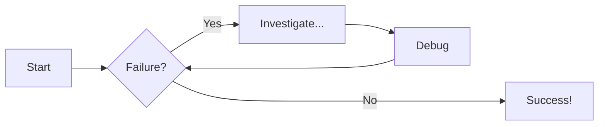
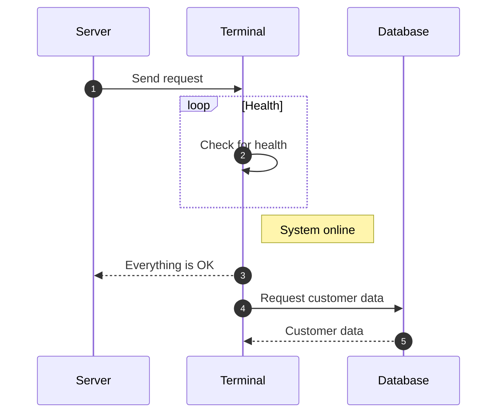

# Diagram Examples

## Flowcharts

From the markdown...

```markdown
    ```mermaid
    graph LR
      A[Start] --> B{Failure?};
      B -->|Yes| C[Investigate...];
      C --> D[Debug];
      D --> B;
      B ---->|No| E[Success!];
    ```
```

...MkDocs produces



## Sequence Diagrams

From the markdown...

```markdown
    ```mermaid
    sequenceDiagram
      autonumber
      Server->>Terminal: Send request
      loop Health
          Terminal->>Terminal: Check for health
      end
      Note right of Terminal: System online
      Terminal-->>Server: Everything is OK
      Terminal->>Database: Request customer data
      Database-->>Terminal: Customer data
    ```
```
...MkDocs produces

